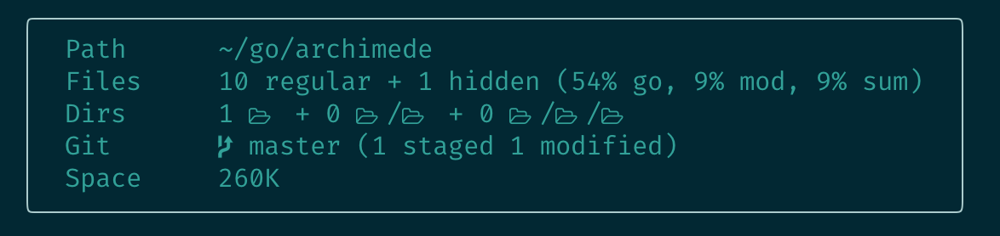

<h1 align="center">
  <br>
  
  <br>
  archimede
</h1>

<h2 align="center">
  <a href="#" onclick="return false;">
    
  </a>
  <a href="https://golang.org/">
    
  </a>
  <a href="https://github.com/gennaro-tedesco/archimede/releases">
    
  </a>
</h2>

<h4 align="center">Unobtrusive project information fetcher</h4>
<h3 align="center">
  <a href="#Installation">Installation</a> •
  <a href="#Usage">Usage</a> •
  <a href="#Examples">Examples</a>
</h3>


The unobtrusive, fast and informative project information fetcher. Whether it is a new git project or old legacy code, visualise a quick summary of directory structure, files composition, disk space and status.


## Installation
Go get it!
```
go get github.com/gennaro-tedesco/archimede
```

## Usage


Various flags allow to customise the output: see `archimede --help` for full details or examples below

| flag             | type   | description                               | default
|:---------------- |:------ |:----------------------------------------- |:-------
| -s/--short       | bool   | display output in short format?           | false
| -g/--git         | bool   | include `./.git` folder in files stats?   | false
| -e/--exclude-dir | string | directory to exclude from stats/counts    | none
| -v/--exclude-file| string | file type to exclude from stats/counts    | none
| -c/--colour      | string | choose display text color (see `--help`)  | cyan
| -d/--delimiter   | string | choose delimiter character                | empty string
| -h/--help        |        | open the help page                        |

Notice that the default display option in long format (no `-s` flag) makes use of unicode
terminal characters that may not render perfectly with all terminals/fonts: if so use `-s`.

## Examples
```
# short format, blue text
archimede -s -c blue
```
<details>
  <summary>Show output</summary>

  
</details>

```
# change delimiter, exclude test folder
archimede -d":" -e test

# short format, exclude .vim files
archimede -s -v .vim
```

```
# display help page
archimede --help
```
<details>
  <summary>Show output</summary>

  
</details>

## Feedback
If you find this application useful consider awarding it a ⭐, it is a great way to give feedback! Otherwise, any additional suggestions or merge request is warmly welcome!

